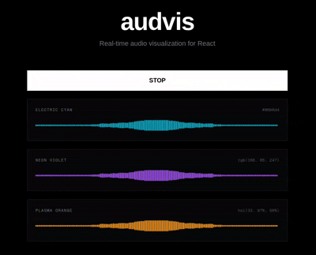
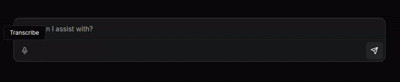

# audvis 
> A React audio visualizer component with Web Audio API support. Perfect for music players, voice recorders, and real-time audio applications.
> 
[](https://www.npmjs.com/package/audvis) [](https://www.npmjs.com/package/audvis)
> 
<div align="center">



</div>


## Installation

```bash
npm install audvis
```

or with pnpm:

```bash
pnpm add audvis
```

or with bun:

```bash
bun add audvis
```

## Usage
This package has two main components AudioVisualizer and useAudioAnalyser. AudioVisualizer takes in an state the will turn it on and off. useAudioAnalyser is used to see if the analyser has been initialized and to disconnect it when not in use.

### Basic Example

```tsx
import { AudioVisualizer, useAudioAnalyser } from 'audvis'
import { useState } from 'react'

export function MyAudioVisualizer() {
  const [isRecording, setIsRecording] = useState(false)
  const { analyser } = useAudioAnalyser(isRecording)

  return (
    <div>
      <button onClick={() => setIsRecording(!isRecording)}>
        {isRecording ? 'Stop' : 'Start'}
      </button>
      {analyser && (
        <AudioVisualizer 
          analyser={analyser} 
          isActive={isRecording}
          color="#ef4444"
        />
      )}
    </div>
  )
}
```

## Components

### `AudioVisualizer`

React component that renders an audio visualization canvas.

#### Props

- `analyser` (AnalyserNode, required) - Web Audio API AnalyserNode instance
- `isActive` (boolean, required) - Whether the visualization should be active
- `width` (number, optional) - Canvas width in pixels (default: 680)
- `height` (number, optional) - Canvas height in pixels (default: 30)
- `color` (string, optional) - Bar color as CSS color value (default: "#ef4444")

### `useAudioAnalyser`

React hook that manages audio context and analyser node.

#### Parameters

- `isRecording` (boolean) - Whether to initialize audio capture

#### Returns

```tsx
{
  analyser: AnalyserNode | null,
  disconnect: () => void
}
```

## Example with Next.js

```tsx
'use client'

import { AudioVisualizer, useAudioAnalyser } from 'audvis'
import { useState } from 'react'

export default function Page() {
  const [isRecording, setIsRecording] = useState(false)
  const { analyser } = useAudioAnalyser(isRecording)

  return (
    <div className="flex flex-col gap-4">
      <button 
        onClick={() => setIsRecording(!isRecording)}
        className="px-4 py-2 bg-blue-500 text-white rounded"
      >
        {isRecording ? 'Stop Recording' : 'Start Recording'}
      </button>
      
      {analyser && (
        <AudioVisualizer 
          analyser={analyser}
          isActive={isRecording}
          width={680}
          height={40}
          color="#3b82f6"
        />
      )}
    </div>
  )
}
```
## Use Cases
- Use for your AI chatbot to show the audio visualization of the user's voice. I recommend using `@lobehub/tts/react` for your speech recognition.



- Use for your music player to show the audio visualization of the user's voice.
- Use for your video player to show the audio visualization of the user's voice.
## Browser Support

Works in all modern browsers that support:
- Web Audio API
- Canvas API
- requestAnimationFrame

## License

MIT
